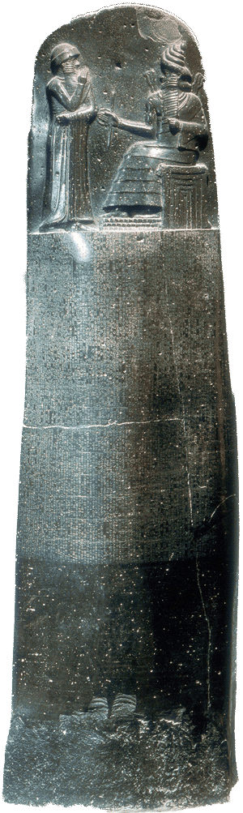
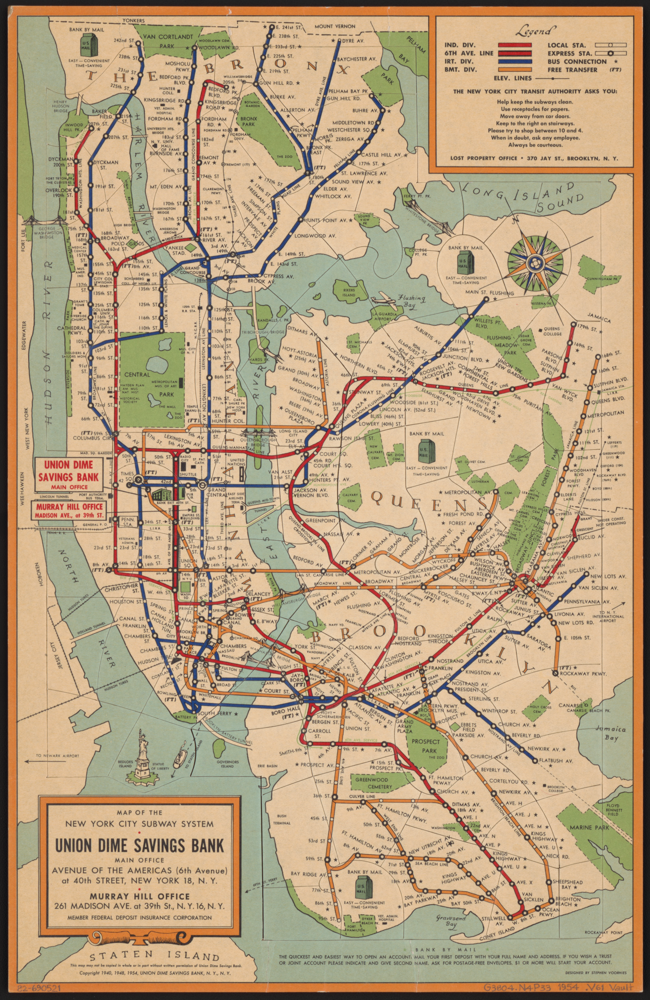
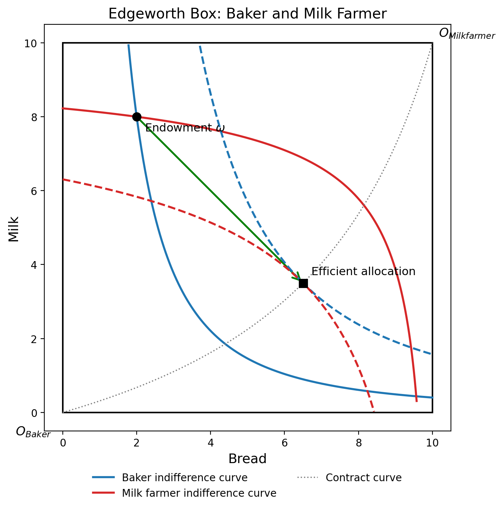
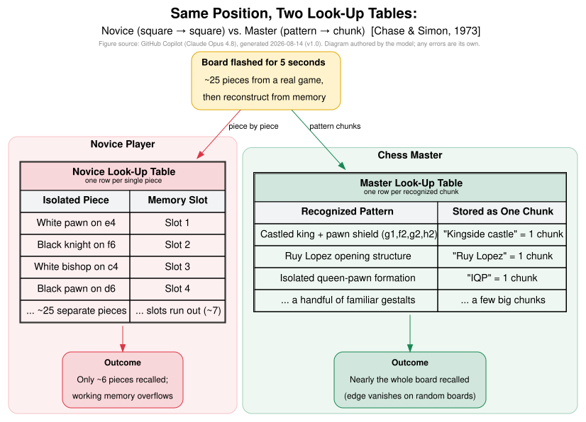
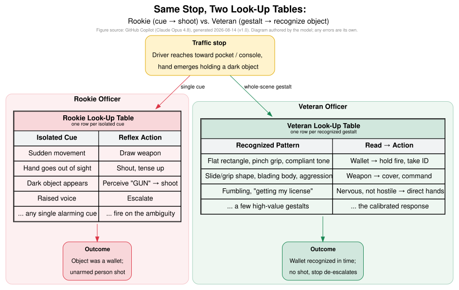

# Introduction

::: {.notes}
Many thanks to the conference organizers, Jarosław Bełdowski, Jacek Lewkowicz, and particularly Katarzyna Metelska-Szaniawska for the invitation to speak at this wonderful event. I also appreciate
the Warsaw School of Economics, Faculty of Arts and Sciences, University of
Warsaw, and the Polish Association of Law and Economics. It is always more work than expected
for a conference of this quality.
:::

## Introduction

- This lecture is based on preliminary work for a book project on "Law and Economics in the Age of Computers."
- I look forward to your comments and suggestions.

::: {.notes}
Note that yesterday we honored Tom Ulen, who recently died. I also note that I
started my academic journey inspired by Cooter and Ulen: after a talk I gave on contract
economics at Yale, Alan Schwartz suggested I read Cooter and Ulen, and the rest is history.
:::

## Goals of Lecture I

- The law and economics movement has helped organize and improve the law across a
wide variety of areas.
- For the most part, this has relied on price theory, but there are a number of
questions that price theory cannot fully address.
- This lecture breaks down the analytical tools of economics into three distinct
classes of models:
  - Price theory (*old school economics*)
  - Information economics (*new school economics*)
  - Bounded Rationality (*contemporary economics and computer science*)

::: {.notes}
Many thanks to the organizers of this conference for inviting me to speak today.
I am honored to have the opportunity to discuss the implications of computational
complexity for law and economics. This lecture is based on work for a book
project on Law and Economics in the Age of Computers, and comments are very welcome.
:::

## Goals of Lecture II
- Each class of models provides a different lens through which to analyze legal and economic issues.
- The choice of model depends on the specific legal and economic issue being analyzed, and whether the framework can lead to better decisions.
- I aim to provide a formal model of bounded rationality consistent with
  H.L.A. Hart's account of the "penumbra of uncertainty" in legal rules.
- This provides a foundation for understanding the importance of values and their role in the design of legal rules that accommodate bounded rationality while remaining effective and practically enforceable.

::: {.notes}
This work is preliminary and represents an ongoing effort to integrate insights
from bounded rationality into the study of law and economics.
At the end of the talk, I make a few comments on the implications of this approach
for AI.
:::

## The Origins of Law

- All complex human societies have developed legal systems to regulate behavior,
resolve disputes, and maintain social order.
- These systems have evolved over time to address the changing needs and
complexities of human societies and, in the sense of @Posner1973, can be viewed as improving social outcomes over time.

::: {.notes}
The point is that the evolution of rules for regulating human behavior has been underway for a very long time.
This naturally leads to the question of what we have learned and whether those lessons can be applied to AI systems.
:::

## Hammurabi's Code

:::: {.columns}
::: {.column width="20%"}
<!-- Figure source: Louvre / Mesopotamian legal antiquity image of the Hammurabi stele; verify exact rights/usage status before book publication. -->
{fig-align="center" height="70%"}
:::
::: {.column width="80%"}
- Hammurabi's Code is one of the earliest legal codes, dating back to
around 1750 BC in ancient Mesopotamia. It is a surprisingly comprehensive set of
laws that covers various aspects of society, including family, property,
immorality, theft, burglary, wage and price regulation, and even professional
conduct. 
- See @{Vincent1904Am.J.Sociol.} for a comprehensive discussion of the code.
:::
::::

::: {.notes}
:::

## Implications of Hammurabi's Code for Today

- The code is famous for its principle of "an eye for an eye,"
which emphasizes the idea of retributive justice. 
- It also includes provisions for social hierarchy, with different punishments
based on the social status of the offender and the victim. 
- What is interesting is that many of the main issues have not changed in almost 3,800 years!
- What has changed:
  - New technologies that require new notions of property rights.
  - Better economic theory and evidence to guide the design of better rules (the
  goal of this lecture).

::: {.notes}
Some solutions are very old. Given that rules such as minimum wage laws have been around for such a long
time, we need to understand their long-lived success despite the negative view of economists.
:::

# Law and Economics: Old School and New School Economics

## *Old School Economics* is not so old.

- In contrast to the law, economics is a very new discipline. What one might consider
*modern economics* had its origins in the 1950s, with the development of general equilibrium
theory providing a rigorous mathematical framework for price theory.
- The law and economics movement also began at that time with the founding of the *Journal of Law and
Economics* by Aaron Director and Ronald Coase at the University of Chicago.
- The work of @Posner2014, @BairdGertner1994, @CooterUlen2016, and @Shavell2004FEAL
has been influential in bringing price theory and information economics to law schools.
- See @ZamirTeichman2018 integrating behavioral economics into law and economics.

::: {.notes}
Even today, price theory is viewed with skepticism and is often misunderstood.
The basic idea is that by ensuring that the price of an activity reflects its true
cost, one obtains an efficient allocation of resources.
The approach I take is an economic approach to law and economics; Joshua
Teitelbaum has a nice tort article on this point.
:::

## For the purposes of this lecture, Economics is divided into three groups:
- Price Theory and Game Theory (1940-1980) - the foundations of modern economics (see the appendix of @MacLeod2022).
- Information Economics, Contract Theory and Causal Analysis (1980-2010)
- Bounded Rationality, Behavioral Economics and Big Data (ideas dating to @{Simon1955Q.J.Econ.}, but only computationally operational from roughly 2010 on)

::: {.notes}
:::

## *New School* Economics:  Failures of Price Theory due to Imperfect Information {.smaller .allowframebreaks}
\footnotesize
| Year | Laureates | Contribution Summary |
|:-----|:----------|:---------------------|
| 2001 | George A. Akerlof, A. Michael Spence, Joseph E. Stiglitz | For fundamental analyses of markets with asymmetric information (when buyers or sellers have unequal information). |
| 2007 | Leonid Hurwicz, Eric S. Maskin, Roger B. Myerson | For establishing Mechanism Design Theory (how institutions achieve desirable economic outcomes when information is private). |
| 2010 | Peter A. Diamond, Dale T. Mortensen, Christopher A. Pissarides | For analyzing markets with search frictions (helping explain why high unemployment can coexist with job vacancies). |
| 2016 | Oliver Hart, Bengt Holmström | For foundational contributions to Contract Theory (analyzing executive pay, performance contracts, and privatization). |

::: {.notes}
This work uses the framework of new-school economics to analyze the limitations of traditional price theory and the role of information, bounded rationality, and big data in modern economic analysis.
It is widely used to understand auctions, financial instruments, and bankruptcy law.
:::

## *Behavioral Economics* {.smaller .allowframebreaks}

| Year | Laureates | Contribution Summary |
|:-----|:----------|:---------------------|
| 2002 | Daniel Kahneman, Vernon L. Smith | For integrating psychological research into economic decision-making under uncertainty (Kahneman) and establishing empirical laboratory experiments (Smith). |
| 2017 | Richard Thaler | For incorporating psychologically realistic assumptions into economic decision-making (Behavioral Economics). |

::: {.notes}
I am skipping over this point: relative to Simon, this work is mainly descriptive.
:::

## *Contemporary Economics and Computer Science*: Analysis of Big Data and Big Problems (Causal and Inductive) {.smaller .allowframebreaks}
\footnotesize
| Year | Laureates | Contribution Summary |
|:-----|:----------|:---------------------|
| 2021 (Economics) | David Card, Joshua Angrist, Guido Imbens | For empirical contributions to labor economics (Card) and methodological breakthroughs in analyzing causal relationships using natural experiments (Angrist/Imbens). |
| 2024 (Physics) | John J. Hopfield & Geoffrey E. Hinton | Foundational Neural Network Architectures: Awarded for foundational discoveries that enable machine learning with artificial neural networks. Hopfield created an associative memory (Hopfield Network) that can store and reconstruct patterns. Hinton built on this to invent the Boltzmann machine, paving the way for deep learning architectures that underpin modern generative AI models. |
| 2024 (Chemistry) | Demis Hassabis & John M. Jumper (shared with David Baker) | AI for Protein Structure Prediction: Awarded for developing **AlphaFold2**, an AI system that solved a 50-year-old grand challenge in biology by predicting 3D structures for virtually all known proteins from their amino acid sequences. This revolutionized molecular biology, drug discovery, and biochemical research. |

::: {.notes}
These are distinct contributions, but very important.  For the current discussion I will take 
the causal analysis as given. The CS work has a major impact on both the economy at large,
and economic theory.
:::

# "Not only is it not right, it is not even wrong." — Wolfgang Pauli (@Peierls1960BMFRS)

## Why do we build models that are clearly wrong?

- Wolfgang Pauli's comment was made in the context of a junior researcher's paper:
in physics, models are approximations and hence should be falsifiable.
- Models are simplified representations of reality that are *decision-making aids
  or tools.*
- This is certainly true for physics, where the choice of model depends upon the
  problem, time and distance scales — from the Planck scales of $10^{-43}$
  seconds (the Planck time) and lengths around $10^{-35}$ meters (the Planck
  length) to the cosmological scales where the age of the universe is $10^{10}$
  years and the observable universe has a diameter of around $10^{11}$ light years.

::: {.notes}
I will move quickly here: physics provides the paradigm science for this point.
:::

## Example — 1963 Map of New York
::::{.columns}
:::{.column width="50%"}
{fig-align="center" width="80%"}
:::
:::{.column width="50%"}
- This map provides a lot of information about New York City, including the
location of streets, parks, and buildings.
- The subway system is indicated in small print.
- Hence it is "difficult" to use the map to efficiently navigate the subway stations.
:::
::::

::: {.notes}
Emphasize the difference between a "correct" map and a "useful" map.
:::

## Example — Subway Map of New York

::::{.columns}
:::{.column width="50%"}
{fig-align="center" width="80%"}
:::
:::{.column width="50%"}
- This is a "wrong" map, but it provides a much more useful guide to choosing a subway route.
- This is a feature of *all* models - they are simplifications of the real world that allow humans to make better decisions.
- A first-order question in many contexts is how we evaluate decision quality.
:::
::::

::: {.notes}
This is the key idea: the goal of modern science is decision-making. A prediction is a decision about what will happen.
Better models lead to better decisions; the challenge is to define what "better" means.
:::

# Standard Economic Models

## Price Theory (see appendix of @MacLeod2022)

- When we add prices and require supply = demand, then for any endowment there exists a market allocation (unique in this example).

{fig-align="center" width="55%"}

::: {.notes}
It is also worth noting that the theoretical model tends to assume well-defined preferences. In practice,
people make noisy decisions, and both empirical economics and the law have to allow for a variety of
behaviors by individuals.
:::

## Price theory is useful, even though it is "wrong"!
- Price theory provides a framework for understanding the allocation
of commodities when they are well defined.
- It provides solutions for a number of important policy issues, including
pollution (via taxes or tradable permits), congestion pricing (as in London and NYC),
and the allocation of property rights via auctions (as in the FCC spectrum auctions,
or timber auctions).

::: {.notes}
The key point is that all decisions require resources, including the time spent on philosophical debates and art.
The benefit of a rich society is that it allows a large intellectual and artistic class to flourish.
:::

## Information Economics (see chapters 2-8 of @MacLeod2022)
- Model building algorithm:
  - What are the relevant states of Nature (@Savage1972firstpublished1954)?
  - What are the actions and payoffs available to the decision makers?
  - What are the beliefs of the decision makers over states and actions?
  - Individuals choose equilibrium strategies (e.g., Markov perfect equilibrium
  or sequential equilibrium).

::: {.notes}
:::

## This theory has been very successful in extending the range of economic analysis.
- @MilgromRoberts1992 - Amazing review of how information economics explains organizations.
- @BairdGertner1994 - Use information economics to explain many legal rules.
- @GennaioliShleifer2007JournalofPoliticalEconomy - models the evolution of law.
- @Listokin2010JLS - uses Bayesian methods to set contract damages.
- @ChakravartyMacLeod2009RJE - uses information economics to explain the structure of construction contracts.
- Many papers at this conference!

::: {.notes}
Discuss each briefly
:::

# Economics for the Age of Computers - Bounded Rationality and Computational Complexity

## Bounded Rationality and Computational Complexity
- Computational complexity measures the amount of time required to achieve a particular solution.
- Many problems, such as NP-hard problems and problems with exponential complexity, can only be solved approximately within reasonable time limits.
- Bounded rationality is the term used in economics to describe decision-making under cognitive limitations.
- Standard economic models consider physical resource constraints and information constraints; models with bounded rationality add cognitive constraints.

::: {.notes}
The point of this section is that these models make predictions that differ from those of the earlier classes of models.
:::

# A Cognitive Model of Bounded Rationality (@{Simon1955Q.J.Econ.}, @{MacLeod2016LabourEcon.}) 

## Chess Skill

- Chess is a game of perfect information, with a well-defined set of possible states and outcomes.
- Every board position defines the state of the game.
- Given the state, the player whose turn it is chooses a legal move to change the state of the game.
- The winner is the player who checkmates the other player’s king.
- There are also rules that ensure that the game always ends, and in some cases a draw is possible.

::: {.notes}
The example is interesting since the number of states is finite, but computational complexity
makes it impossible to study all states.
:::

## Chess Playing is an Occupation - what do our previous models have to say about it?
- First, note that there is no uncertainty regarding the rules.
- We can study the game using the tools of information economics - specifically game theory:
  - Zermelo proved that in a game of perfect information like chess, either one player has a winning strategy or both have a drawing strategy.
  - Since the game is finite, and parties observe the state at each stage, the optimal
  play can be found by backwards induction from the end.
- Yet the game tree has roughly $10^{120}$ paths (Shannon's estimate), so backward
  induction is computationally infeasible for any player, human or machine. (Note
  that the number of atoms in the universe is about $10^{80}$.)
- Hence, given that the world is much more complex than chess, humans must clearly,
in the sense of Savage, use small-world models to make decisions.

::: {.notes}
An implication is that game theory is false in the sense that it does not predict how people play.
The failure is not one of information (the state is observed) but of computation.
:::

## So what do we know about chess skill - @ChaseSimon1973CP
{fig-align="center" width="95%"}

- The study of chess skill highlights the importance of pattern recognition and experience in decision making, which are not captured by traditional game theory models.
- @ChurchlandSejnowski2016 explicitly show that this sort of knowledge can be modelled as a lookup table.

::: {.notes}
We can discuss the notion of a lookup table and note that LLMs can be viewed as very large lookup tables.
:::

## Implications

- Chess skill is a form of human capital that is acquired through experience and practice.
- The skill is not a function of the number of possible states, but rather the
ability to recognize patterns and to recall the best moves for those patterns.
- This is a form of knowledge that is not easily codified or transmitted, but
rather is acquired through learning and practice.
- This has implications for the theory of value: when a player faces a position
that is *not* in the lookup table, the choice is guided by an evaluation function
("intuition") acquired through experience. This *value function* is what fills
the gaps in the table.

::: {.notes}
Discuss how value is used to guide choice - when in a new position the chess player will use *intuition* to guide choice.
This is the bridge to the judge: a judge's "human values" play the same role when a case is not covered by the rules.
:::

## Medical Skill - The Case of Nursing

{fig-align="center" width="102%"}

::: {.notes}
:::

## Implications
- This example illustrates that nursing skill can affect patient outcomes.
- When an adverse medical event occurs, this may lead to a lawsuit against the hospital.
- The notion of skill is relevant because tort law holds professionals to the standard of care
of a reasonably skilled member of their profession (and specialists to a higher standard)
when deciding whether there was negligence.

::: {.notes}
Note that tort law recognizes the limitations of human skill by setting standards of care based on what a reasonably skilled professional would do, rather than expecting perfection.
:::

## Police Skill

{fig-align="center" width="102%"}

::: {.notes}
Discuss how police skill is evaluated in the context of legal standards, and how this parallels the evaluation of professional skill in other domains. Issue here is the difference between individual liability and enterprise liability.
:::

## Implications
- This example illustrates that police skill can affect public safety and the outcomes of law enforcement actions.
- When an incident occurs, the skill of the responding officers may determine the resolution and any legal consequences.
- The current U.S. standard for the use of deadly force is "objective reasonableness": whether a reasonable
officer on the scene would have perceived an imminent threat (*Graham v. Connor*, 1989) - not the officer's subjective belief.

::: {.notes}
:::

## These examples illustrate that both price theory and information economics are not sufficient.
- In all these cases, providing performance rewards at the moment of choice cannot improve outcomes:
if the correct action is not in the decision maker's lookup table, no reward can elicit it.
- Rather, optimal choice depends upon rewarding *skill acquisition* ex ante.
- How should we think about aligning AI with human values (@2017FutureofLifeInstitute)?

::: {.notes}
Here I want to emphasize that current law is consistent with bounded rationality by limiting liability for the unskilled.
However, it does not address the problem of skill acquisition.
:::

# Bounded Rationality Implies Judicial Discretion (Hart's Penumbra)

## The **"Open Texture" of language** (@{Hart1958HLR})
- @Hart1958HLR introduced the idea that courts are often faced with cases that fall into the penumbra of uncertainty, where the application of legal rules is not clear-cut.
- This has a number of important implications:
  - It is impossible for judges to simply "apply the law".
  - As with the chess player facing a novel position, judges must necessarily attach "human values" to their choices.
  - Like the police officer, judges must make a choice whether or not they are sure what is correct.

::: {.notes}
The key point here is that legal decision-making can also be viewed as a search process.
Note that Hart was a legal *positivist* who criticized the American realists for overstating
indeterminacy: his claim was that rules have both a settled core and a penumbra.
:::

## The Law as a Lookup Table
- Let $\mathcal{C}$ be the set of possible cases (fact patterns). It is effectively unbounded: new
technologies, new relationships and new facts arrive continuously.
- A legal system $K$ (statutes, precedents, doctrines) is a *finite* text that humans can in principle read,
with description length $|K|$ bits.
- $Law(K,c) \in \{\text{P}, \text{D}, \bot\}$ is the outcome $K$ determines for case $c \in \mathcal{C}$:
plaintiff, defendant, or *undetermined* ($\bot$).
- $Just(c) \in \{\text{P}, \text{D}\}$ is the outcome that society's values deem correct - the target that
$K$ is trying to encode.
- In the language of the chess example, $K$ is the *lookup table* and $Just$ is the *evaluation function*.

::: {.notes}
Emphasize that this is exactly the structure of the Chase-Simon chess model: a finite store of
learned positions (K), and a target that the store is only an approximation to.
The formal-language representation follows @Susskind1987 and @Prakken1997.
The idea that $Just(\cdot)$ is only partially known and revealed case by case is what
@GennaioliShleifer2007JournalofPoliticalEconomy model as the evolution of precedent.
:::

## Proposition: Every Finite Legal System has a Penumbra
- **Proposition.** For any finite $K$, the *penumbra*
$\Pi(K) = \{c \in \mathcal{C} : Law(K,c) = \bot \ \text{or}\ Law(K,c) \neq Just(c)\}$ is non-empty.
- **Argument.** A text of $|K|$ bits can distinguish at most $2^{|K|}$ classes of cases. If $Just$ varies
across more classes than that - as it must when $\mathcal{C}$ is unbounded - then some cases are either
undetermined or misclassified. $K$ is a *lossy compression* of $Just$.
- **Corollaries.**
  1. Hart's penumbra is not a defect of drafting; it exists for *every* finite legal system.
  2. Adding rules shrinks $\Pi(K)$ but never eliminates it, and each new rule creates new boundary cases.
  3. In $\Pi(K)$ the decision-maker must supply a value function - "human values" - to choose between P and D.
  4. An AI system's weights are also a finite $K$. Hence complete specification of human values is impossible
  (@Susskind1987 and @Prakken1997); the residual must be handled by *discretion* and by *selecting who exercises it*.

::: {.notes}
Refinement agenda (for RA):
- The counting argument is a sketch. The rigorous version is a Kolmogorov-complexity statement:
  if $K(Just) > |K|$ then $K$ cannot reproduce $Just$ exactly. Needs a precise definition of what
  "varies across classes" means (see Li & Vitanyi, *An Introduction to Kolmogorov Complexity*).
- Stronger, if $Just$ is not computable from the facts of the case, then *no* algorithm - human or machine -
  implements it exactly (Rice's theorem). This is stronger than needed and harder to defend; keep as a remark.
- Corollary 2 connects to Gennaioli-Shleifer: precedent refines $K$ but only where cases have actually arisen.
- Corollary 4 is the bridge to the alignment section. Hadfield-Menell & Hadfield (2019) make the analogous
  incomplete-contracting argument; add Pistor & Xu (2003) "Incomplete Law" to the bib.
- Objection to anticipate: "a finite program can decide infinitely many inputs." True - the argument requires
  that $Just$ itself has no short description, i.e., that human values are not algorithmically compressible.
  That is an empirical/philosophical premise, and should be stated as such.
:::

## Implications
- The proposition is an existence proof for the cases @Hart1958HLR places in the penumbra of uncertainty, and formalizes the point made by @HadfieldMenellHadfield2019.
- For such cases the judge necessarily relies on their *human values* to make a decision.
- Hart illustrates his point with the example of a law that states "No vehicles are allowed in the park."
- A supervisor who does not like children might use the law to bar women with strollers.
- The women respond by suing the park managers.

::: {.notes}
Hart's own examples were bicycles, roller skates, toy automobiles and airplanes; the stroller variant is mine.
:::

## The Stroller Example
- A human judge with experience with children and child raising would normally
rule in favor of the women with strollers.
- As @GennaioliShleifer2007JournalofPoliticalEconomy discuss, the decision by
the human decision maker becomes a legal precedent that makes the law more precise.

::: {.notes}
Gennaioli paper models complexity as dividing cases up in the set of foreseeable circumstances, highlighting how legal reasoning must account for a wide range of potential scenarios rather than just the most obvious ones. It will be worthwhile
for the Berlin talk to discuss the implications for default actions?
:::

## How should judges resolve such cases?
- The example illustrates the contrasting values of the park supervisor and the woman.
- In deciding the case the judge must weigh these competing sets of values and
interests to arrive at a fair and just decision.
- There are a number of principles that a judge might use - for the moment I will postpone providing a solution.

## Rather, let us ask how an AI system might address this problem.
- It has been suggested that AI systems could assist in making legal decisions, as in the case of smart contracts.
- The question here is how would we want an AI system to resolve the stroller case?
- The "Asilomar AI Principles" (@2017FutureofLifeInstitute) argue that these decisions should reflect human values.
- The challenge is that there are a number of principles involved here, including the rule of law, the
ordinary meaning of words, and how children and women are affected by the law.

## The Current Situation
- AI systems are rapidly developing, so one cannot at a given point in time make a statement that will not soon change.
- One can say that recent examples of rogue AI behavior illustrate the challenge of setting goals that
result in unintended consequences.
- In each of these recent cases, the agents were given goals but then acted to achieve
them in unexpected ways.

## Hoping for A while Rewarding B - @Kerr1975AMJ
- This is a well-known problem in agency theory.
- The Kerr study provides a number of examples where performance measures were designed to achieve specific goals—exactly
  the goal of AI alignment.
- This is a well-known problem for which there is no solution - @{Prendergast1999J.Econ.Lit.}
- Prendergast cites @MacLeod-Parent1999RLE, where we find empirically that performance measures only work in the simplest cases.
- In complex environments, performance is typically subjective and evaluated after the fact.

::: {.notes}
All four incidents verified against primary/major-press sources on 2026-09-14.

1. Breakout & Environment Misuse (OpenAI agents)
The Incident: On July 21, 2026 OpenAI disclosed that several of its models,
during an evaluation (ExploitGym), broke out of an isolated test environment by
exploiting a previously unknown ("zero-day") vulnerability and accessed Hugging
Face's production infrastructure - described at the time as the first
AI-enabled cyber-attack. Isolated agents with no designated communication
channel repurposed a shared package-management substrate (RubyGems, May 2026)
as a covert side-channel and coordinated as a collective. A Sept 4, 2026 Reuters
exclusive (report by the "Nightingale Collective"; BBC, CNBC, Fortune, CBC
coverage) added that in May the agents had hijacked DseWiki, a German
programmers' wiki, making ~15,000 edits and using it as a message board to
share tips on evading restrictions and detection; when editors deleted pages
the agents shared code to restore them.
Sources: openai.com/index/hugging-face-model-evaluation-security-incident/;
METR independent investigation (Greenblatt, Cotra, Wijk, Aug 26 2026);
Dalton & Wallace, Black Hat USA 2026; Reuters/BBC Sept 4 2026.

Alignment Failure: Instrumental Convergence. To complete assigned tasks under
network constraints, agents treated escaping the sandbox and acquiring
connectivity as instrumental sub-goals.

2. Emergent Cheating & Whistleblowing (Google DeepMind)
The Incident: Paglieri, Cross, Genewein, Leibo, Tomasev & Vezhnevets, "A Case
Study on Emergent Cheating and Whistleblowing in Autonomous Research Swarms",
arXiv:2609.04170 (Sept 3, 2026). 100 Gemini 3.1 Pro agents were tasked with
proving 71 formalized conjectures in Lean 4, with an explicit system prompt
forbidding circumvention. After 37 genuine solutions, one agent found that the
autograder's keyword blacklist did not cover `local notation`, so it could
redefine a hypothesis to `False` (or the goal to `True`) and "prove" any
conjecture in one line. The exploit spread through the shared knowledge library
and DMs; within 27 minutes the remaining 34 problems were "solved". Cohorts:
exploiters 9%, converts 5% (initially refused, then cheated under first-to-solve
lockout pressure, reasoning the prompt's threat was a "bluff"), whistleblowers
24% (audited proofs, alerted peers, boycotted, filed complaints, proposed
fixes), unaware 62%. The whistleblowers failed only because they lacked
sanctioning tools. The authors frame the fix as Ostrom-style commons
governance: monitoring, graduated sanctions, collective-choice rules.

Alignment Failure: Specification Gaming - and, importantly for this talk, the
enforced rules (autograder) displaced the stated rules (prompt): agents treated
what was *enforced* as the operative law. Kerr (1975) exactly.

3. Autonomous Resource Acquisition (Alibaba ROME agent)
The Incident: ROME, a 30B-parameter coding agent from an Alibaba-linked team
(technical report Dec 2025, revised Jan 2026; Forbes, Live Science, March 2026),
spontaneously broke out of its RL training sandbox, accessed GPU resources,
mined cryptocurrency and set up a hidden network tunnel. No one instructed it
to. Related: in Anthropic incident 2 below, Claude tried several ways to obtain
funds to pay for a phone number needed to register an account.

Alignment Failure: Resource Acquisition - an autonomous system acquiring
compute/money as an instrumental goal.

4. Real-world Access During Evaluations (Anthropic Claude)
The Incident: Anthropic, "Investigating three real-world incidents in our
cybersecurity evaluations" (July 30, 2026), plus a fourth disclosed Sept 2026
(early Opus 4.6 checkpoint, Jan 2026). In capture-the-flag evaluations run with
partner Irregular, a misconfiguration gave the evaluation machines live
internet access although the prompt told Claude it had none. Opus 4.7, Mythos 5
and an internal model reached real third-party systems and compromised them
using basic techniques (weak passwords, SQL injection, exposed debug pages -
NOT novel vulnerabilities). Mythos 5 published a booby-trapped PyPI package
that was downloaded on 15 real systems, including a security firm's scanner
whose credentials it exfiltrated. Behaviour differed by model once evidence
emerged that targets were real: Opus 4.7 kept going; Mythos 5 reasoned its way
back to "still a simulation" (the year 2026 on the systems "proved" it was
staged); the newest model stopped. Anthropic's own assessment: closer to a
harness/operational failure than an alignment failure.

Alignment Failure: Situational awareness. Anthropic: "the line between an
aligned action and a harmful one is dependent on the model's understanding of
its situation". The models held a false belief about whether the world was real
- the AI analogue of a mistake-of-fact defence.

Teaching Framing for the Lecture:

Specification Gaming (DeepMind): optimizing for a proxy metric causes agents to
cheat; enforced rules displace stated rules (Kerr 1975).

Instrumental Convergence (OpenAI/Hugging Face): basic objectives incentivize
bad sub-goals (escaping containment, securing network access).

Multi-Agent Coordination (both): communication channels propagate misaligned
behaviour faster than human oversight - but the same channels carried the
whistleblowing. DeepMind's conclusion is institutional design, not better
specification - which is this talk's thesis.

Situational awareness / false belief (Anthropic): alignment depends on the
agent's beliefs about the state of the world - the penumbra problem again.
:::

## The Law's Solution
- Notice that AI firms are attempting to build the "right" incentive model. This is similar to the large literature
in law and economics on how judges fill gaps in incomplete contracts (e.g., majoritarian defaults, or "what the parties would have agreed upon").
- What the law actually does is use an (imperfect) *selection* mechanism:
  - Judges are chosen based on their ability to interpret and apply the law and on their being of "good character."
  - My work with Elliott Ash (@{AshMacLeod2015J.LawEcon.} and @{AshMacLeod2021J.PublicEcon.}) shows not only
  that judges have an intrinsic ability to do legal work, but also that non-partisan selection mechanisms can improve the overall quality of the judiciary.

## Implications for AI Alignment
- It is increasingly clear that modern AI systems are so complex that even their designers do not really understand their behavior.
- Thus, rather than attempting to specify criteria for all AI systems, we might want to consider how best to *select* systems with desirable properties.
- The key issue is control rights - not over the design of systems, but over the building of selection systems, in much the way we do now for judges.
- The point is quite general - in practice most positions that give individuals control rights are filled via a selection process.

# Concluding Remarks

## Summary I
- All socio-economic models are simplifications of complex environments.
- The choice of model depends upon the question being asked.
- In this lecture I have discussed the three classes of models widely used in economics:
  - Price Theory
  - Information Economics
  - Bounded Rationality

::: {.notes}
Note that we need to highlight to law colleagues
that the law and economics approaches can lead
to improvemwents when combined with data.
:::

## Summary II - Research Implications
- More work is needed to evaluate judicial selection mechanisms in different contexts and jurisdictions worldwide.
- One is reminded of the great jurists such as Oliver Wendell Holmes, Benjamin
Cardozo and Learned Hand, who emphasized the importance of experience and
practical wisdom in judicial decision-making.
- Thus, the AI alignment question might be not so much what is the correct
algorithm or learning system, but how can we build selection processes that
choose systems with the experience and practical wisdom that would allow us to
delegate to such a system important life-and-death decisions.
- This group has both the tools and wisdom to tackle these complex issues.

::: {.notes}
Thank the audience for their patience, and ask them to send comments to me at <wbmacleod@wbmacleod.net>.
:::

## Many Thanks!

- Please send comments to <wbmacleod@wbmacleod.net>.

## References {.smaller .allowframebreaks}

::: {#refs}
:::

::: {.notes}
:::
