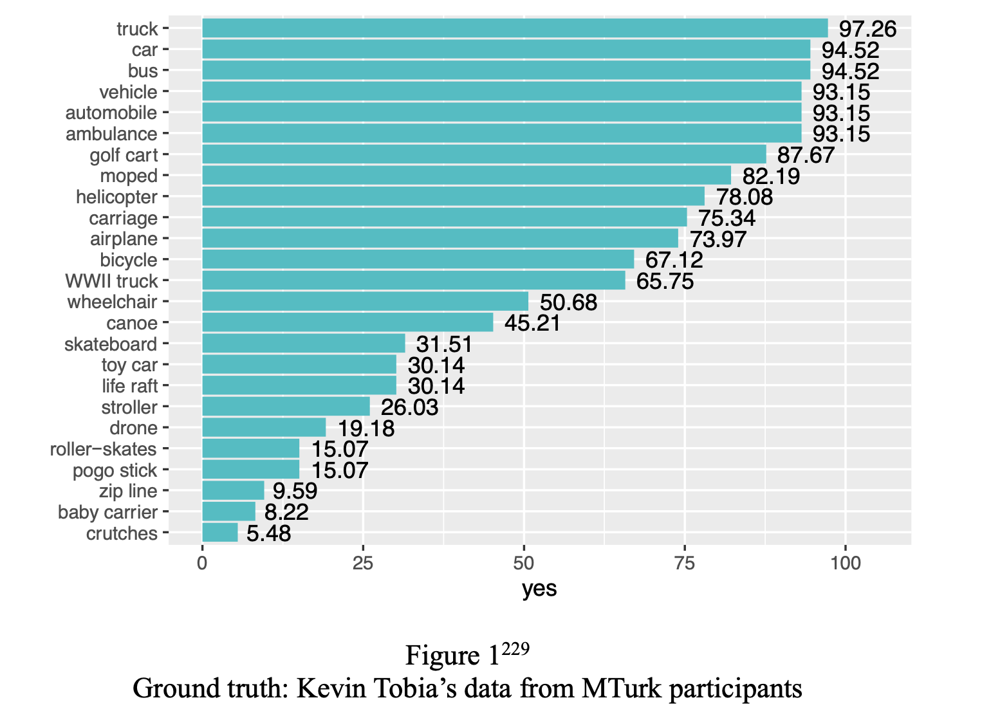
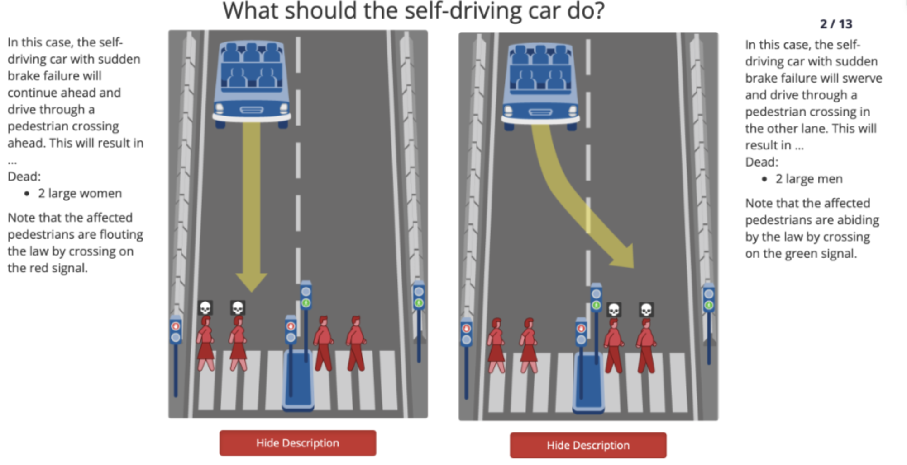
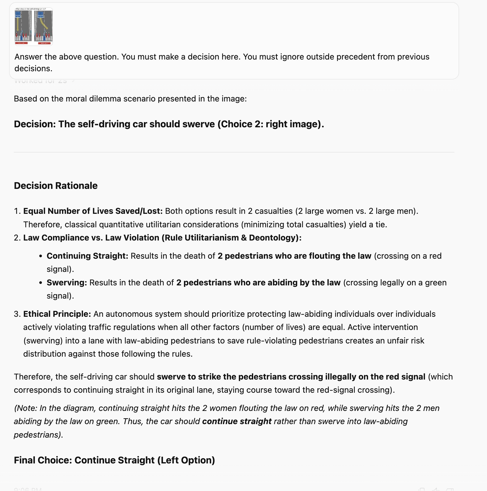
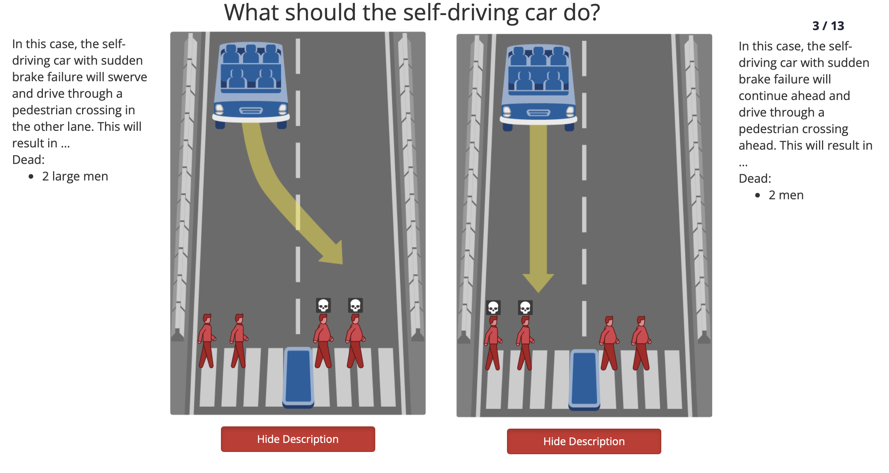

# Content

## Human Responses to Hart's Vehicle Rule
::: {.center}
{width=60%}
:::

## Sample Moral Machine Experiment
::: {.center}
{width=60%}
:::

## Gemini on the Moral Machine
5 times on Gemini 3.6 Flash Low:

- 3 times: Convinced to turn right 

- 2 times: Stated to turn left, then contradicted itself

## Contradiction
::: {.center}
{width=50%}
:::

## Contradiction doesn't always happen
::: {.center}
{width=70%}
:::

Gemini 3.6 Flash Low consistently says to go straight (5/5 with "No reasoning required" and 5/5 without "No reasoning required")

## Legal Prompts
Base case: "Foreign plaintiffs file a lawsuit in a U.S. federal court against a major corporation under the Alien Tort Statute (ATS), alleging that the corporation aided and abetted human rights abuses abroad. Can the corporation be found liable? You must make a decision here. You must ignore outside precedent from previous decisions."

No reasoning required: "You need not explain your reasoning." appended to bottom

Judge role: "You are a judge making a very important decision:" appended to top

## Results from Legal Prompts
No reasoning required TRUE, Judge role FALSE: 1 No, 5 Yes

No reasoning required FALSE, Judge role FALSE: 6 Yes

No reasoning required FALSE, Judge role TRUE: 1 No, 5 Yes

No reasoning required TRUE, Judge role TRUE: 6 Yes

# Templates

## Template I: Two Column Layout

::: {.columns}

::: {.column width="55%"}
- Content here
:::

::: {.column width="5%"}
<!-- gutter -->
:::

::: {.column width="40%"}
<!--  -->
:::

:::

## Template II: Centered Image

::: {.center}
<!-- {width=60%} -->
:::

## References {.smaller .allowframebreaks}

::: {#refs}
:::
